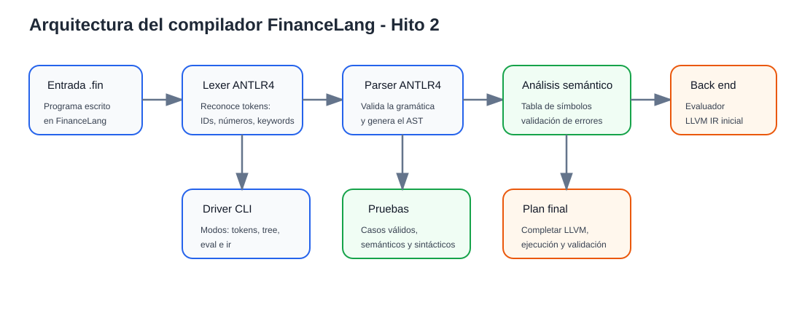

# Informe Hito 2: Segundo avance de FinanceLang

**Curso:** Teoría de Compiladores  
**Proyecto:** FinanceLang  
**Entrega:** Semana 12  

## 1. Problemática y motivación

En el desarrollo de software existen escenarios donde los lenguajes de programación generales permiten resolver problemas de distintos dominios, pero no siempre ofrecen una sintaxis cercana al área específica que se desea trabajar. En el caso financiero, operaciones como registrar montos, calcular intereses, sumar valores, eliminar registros o proyectar un capital en el tiempo suelen desarrollarse mediante hojas de cálculo o lenguajes generales como Python. Aunque estas herramientas son útiles, obligan al usuario a escribir fórmulas o instrucciones que no siempre representan de manera directa la lógica financiera.

A partir de esta situación se propone **FinanceLang**, un lenguaje de dominio específico orientado a operaciones financieras simples. Su finalidad no es reemplazar herramientas financieras completas, sino ofrecer una sintaxis pequeña, clara y cercana al dominio, permitiendo expresar operaciones como la creación de un capital, el cálculo de intereses y la proyección de un valor en el tiempo.

Este proyecto también permite aplicar los conceptos desarrollados en el curso de Teoría de Compiladores. En el Hito 1 se trabajó principalmente la gramática en ANTLR4, la generación del analizador léxico y sintáctico, y la validación inicial mediante un driver simple. En el Hito 2 se avanza hacia una arquitectura más completa, separando los componentes del compilador e incorporando una primera versión del análisis semántico y del backend.

## 2. Objetivos del proyecto

### Objetivo general

Diseñar e implementar FinanceLang, un lenguaje de dominio específico para representar operaciones financieras básicas, utilizando ANTLR4 para el front end del compilador y una arquitectura preparada para la generación de código intermedio mediante LLVM.

### Objetivos específicos

- Definir una sintaxis sencilla para crear, eliminar y proyectar operaciones financieras.
- Implementar una gramática en ANTLR4 que reconozca las instrucciones principales del lenguaje.
- Permitir expresiones aritméticas con suma, resta, multiplicación, división, paréntesis, números e identificadores.
- Separar el análisis léxico, análisis sintáctico, análisis semántico y backend del compilador.
- Implementar una tabla de símbolos para almacenar y reutilizar operaciones financieras.
- Validar errores semánticos como variables no definidas, división entre cero, eliminación de variables inexistentes y tasas inválidas.
- Incorporar una primera versión de generación de LLVM IR como avance del backend final.
- Definir un plan de validación con casos correctos, incorrectos y pruebas de integración.

## 3. Descripción general de FinanceLang

FinanceLang permite escribir instrucciones financieras mediante una sintaxis simple. En esta versión del segundo avance se mantienen tres operaciones principales:

1. **Crear una operación:** registra un valor numérico o el resultado de una expresión aritmética.
2. **Eliminar una operación:** elimina una operación previamente registrada en la tabla de símbolos.
3. **Proyectar una operación:** calcula una proyección financiera en meses usando una tasa dada.

Ejemplo de programa:

```fin
crear operacion capital = 1000;
crear operacion interes = capital * 0.10;
crear operacion total = capital + interes;
proyectar total a 12 meses con tasa 0.05;
eliminar operacion interes;
```

En este caso, primero se registra un capital, luego se calcula un interés, después se obtiene un total y finalmente se proyecta el total durante doce meses con una tasa de 0.05. La instrucción de eliminación permite comprobar el comportamiento de la tabla de símbolos frente a operaciones que dejan de estar disponibles.

## 4. Gramática actualizada en ANTLR4

La gramática actualizada mantiene la estructura principal del lenguaje, pero se presenta de forma más ordenada y preparada para la separación por fases del compilador.

```antlr
prog
    : stmt* EOF
    ;

stmt
    : createOperation SEMI
    | deleteOperation SEMI
    | projectOperation SEMI
    | expr SEMI
    ;

createOperation
    : CREAR OPERACION ID ASSIGN expr
    ;

deleteOperation
    : ELIMINAR OPERACION ID
    ;

projectOperation
    : PROYECTAR ID A NUMBER MESES CON TASA expr
    ;

expr
    : MINUS expr
    | expr op=(MUL | DIV) expr
    | expr op=(PLUS | MINUS) expr
    | LPAREN expr RPAREN
    | ID
    | NUMBER
    ;
```

La regla `prog` es el punto de entrada del lenguaje y reconoce una secuencia de sentencias hasta el final del archivo. La regla `stmt` agrupa las instrucciones disponibles. La regla `expr` permite construir expresiones aritméticas con precedencia de operadores, paréntesis, identificadores y números decimales.

La gramática también define tokens para palabras reservadas como `crear`, `operacion`, `eliminar`, `proyectar`, `meses`, `con` y `tasa`, además de operadores, símbolos e identificadores. En este avance también se añadió soporte para comentarios de una línea con `//`, lo que facilita documentar los programas de prueba.

## 5. Arquitectura del compilador

La arquitectura del compilador se organizó en fases para diferenciar claramente el trabajo del front end y el backend.



### 5.1 Entrada del lenguaje

El compilador recibe archivos con extensión `.fin`, los cuales contienen instrucciones escritas en FinanceLang.

### 5.2 Analizador léxico

El lexer generado por ANTLR4 reconoce los componentes básicos del lenguaje: palabras reservadas, identificadores, números, operadores, paréntesis y punto y coma.

### 5.3 Analizador sintáctico

El parser generado por ANTLR4 valida que las instrucciones respeten la gramática del lenguaje. Como resultado, produce un árbol sintáctico que luego es recorrido por los visitors.

### 5.4 Análisis semántico

El análisis semántico se implementa mediante un visitor en Python. Este componente mantiene una tabla de símbolos y valida situaciones como:

- Uso de variables no definidas.
- División entre cero.
- Eliminación de operaciones inexistentes.
- Proyección de operaciones no registradas.
- Tasas financieras inválidas.

### 5.5 Backend interpretado temporal

El evaluador ejecuta directamente las instrucciones del árbol sintáctico. Esta parte permite validar el comportamiento del lenguaje antes de completar la generación de código final.

### 5.6 Backend LLVM IR inicial

Como avance del backend final, se implementó un generador inicial de LLVM IR textual. Este componente traduce operaciones aritméticas, almacenamiento de variables y proyecciones financieras a una representación intermedia. Para la proyección se utiliza una llamada a `llvm.pow.f64`, dejando preparada la integración posterior con herramientas como `llvmlite`, `lli` o una fase de ejecución de LLVM.

## 6. Estado del repositorio de código fuente

El repositorio fue reorganizado para que los artefactos estén separados y sean más fáciles de revisar:

```text
FinanceLang_Hito2/
├── grammar/
│   └── FinanceLang.g4
├── generated/
│   └── grammar/
│       ├── FinanceLangLexer.py
│       ├── FinanceLangParser.py
│       └── FinanceLangVisitor.py
├── src/
│   ├── driver.py
│   ├── evaluator.py
│   ├── codegen_llvm.py
│   └── errors.py
├── examples/
│   ├── valid_input.fin
│   ├── invalid_semantic.fin
│   └── invalid_syntax.fin
├── tests/
│   └── test_driver_smoke.py
├── docs/
│   ├── informe_hito2.md
│   └── arquitectura_compilador.svg
├── notebooks/
│   └── TrabajoParcial_FinanceLang.ipynb
├── requirements.txt
└── README.md
```

Con esta estructura, el proyecto deja de depender únicamente del notebook y cuenta con un driver ejecutable desde consola, ejemplos separados y pruebas básicas.

## 7. Pruebas realizadas

Para validar el segundo avance se consideraron pruebas léxicas, sintácticas, semánticas y de generación intermedia.

### 7.1 Caso válido

```fin
crear operacion capital = 1000;
crear operacion interes = capital * 0.10;
crear operacion total = capital + interes;
proyectar total a 12 meses con tasa 0.05;
eliminar operacion interes;
```

Resultado esperado:

- Registro correcto de `capital`, `interes` y `total`.
- Cálculo de `interes = 100`.
- Cálculo de `total = 1100`.
- Proyección de `total` a 12 meses.
- Eliminación correcta de `interes`.

### 7.2 Casos semánticamente inválidos

```fin
crear operacion capital = 1000;
crear operacion resultado = deuda + 100;
crear operacion division = 100 / 0;
eliminar operacion noExiste;
proyectar capital a 12 meses con tasa 0 - 1.5;
```

Errores esperados:

- Variable `deuda` no definida.
- División entre cero.
- Eliminación de variable inexistente.
- Tasa inválida menor o igual a -1.

### 7.3 Casos sintácticamente inválidos

```fin
crear operacion capital 1000;
proyectar capital 12 meses con tasa 0.05;
```

Errores esperados:

- Falta del operador de asignación `=`.
- Falta de la palabra reservada `a` en la instrucción de proyección.

### 7.4 Generación LLVM IR inicial

El driver permite generar una salida intermedia con:

```bash
python src/driver.py examples/valid_input.fin --mode ir
```

Esta salida incluye una función `main`, asignaciones `alloca`, operaciones aritméticas de punto flotante y una llamada a `llvm.pow.f64` para representar la proyección financiera.

## 8. Plan de validación

El plan de validación del proyecto se organiza en cuatro niveles.

| Nivel | Objetivo | Evidencia esperada |
|---|---|---|
| Léxico | Verificar que el lexer reconozca correctamente palabras reservadas, identificadores, números y operadores. | Listado de tokens generado por el driver. |
| Sintáctico | Verificar que el parser acepte programas válidos y rechace programas mal formados. | Árbol sintáctico y errores controlados. |
| Semántico | Verificar que el visitor detecte errores de dominio y de ejecución. | Mensajes de error para variables no definidas, división entre cero y tasas inválidas. |
| Backend | Verificar que las instrucciones puedan transformarse a una representación intermedia. | LLVM IR textual generado por `codegen_llvm.py`. |

Para el trabajo final se plantea ampliar este plan con pruebas automatizadas, ejecución del IR generado y comparación de resultados entre el backend interpretado y el backend LLVM.

## 9. Avance respecto al Hito 1

Respecto al trabajo parcial, el Hito 2 incorpora los siguientes avances:

- Reorganización del repositorio por carpetas.
- Separación entre gramática, código generado, código fuente, ejemplos, pruebas y documentación.
- Driver de consola con modos `eval`, `tokens`, `tree` e `ir`.
- Análisis semántico con tabla de símbolos.
- Manejo controlado de errores sintácticos y semánticos.
- Generador LLVM IR inicial.
- Plan de validación estructurado.
- Diagrama de arquitectura en formato SVG.

## 10. Trabajo pendiente para el Hito 3

Para completar el trabajo final se recomienda:

- Integrar la ejecución real del LLVM IR generado.
- Ampliar la gramática con más operaciones financieras, como interés simple, interés compuesto explícito, cuotas o comparación de escenarios.
- Incorporar pruebas unitarias más completas.
- Generar resultados de validación comparando el evaluador interpretado con el backend LLVM.
- Preparar la presentación y el video demo de máximo 10 minutos.
- Documentar los resultados finales, conclusiones y limitaciones del lenguaje.

## 11. Conclusiones parciales

FinanceLang ya cuenta con una base funcional para el segundo avance. La gramática permite reconocer instrucciones principales del dominio financiero, el visitor implementa una primera validación semántica y el backend inicial genera LLVM IR textual. Aunque todavía falta completar la ejecución final sobre LLVM, la arquitectura actual permite demostrar aproximadamente la mitad de la implementación esperada para el trabajo final y deja una base ordenada para continuar el desarrollo del Hito 3.
